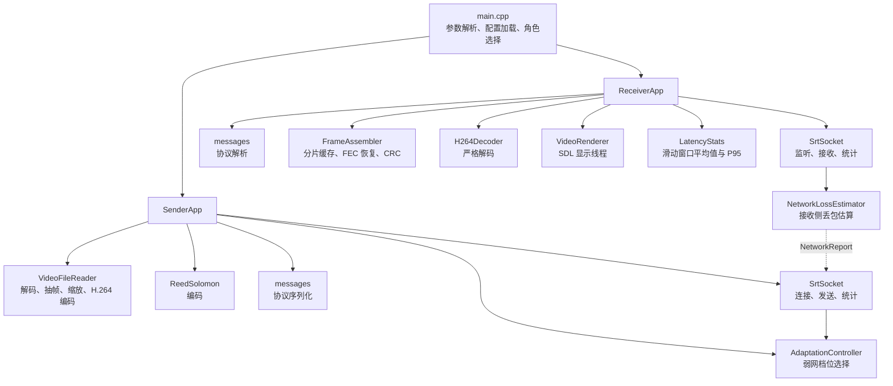
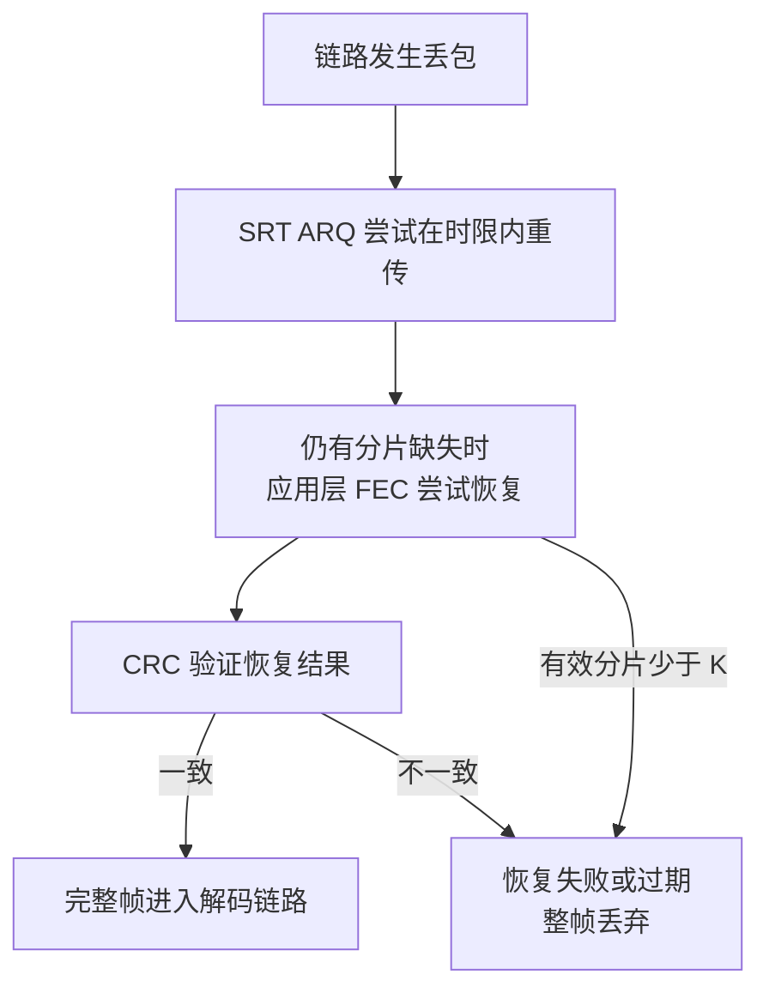
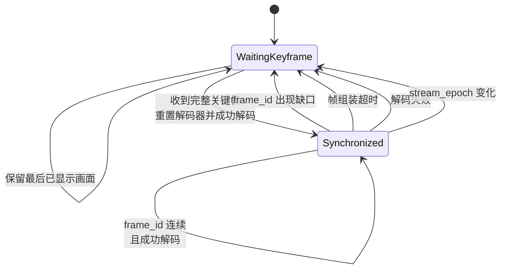
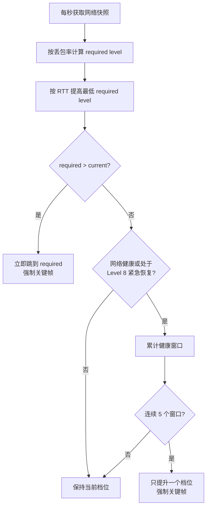
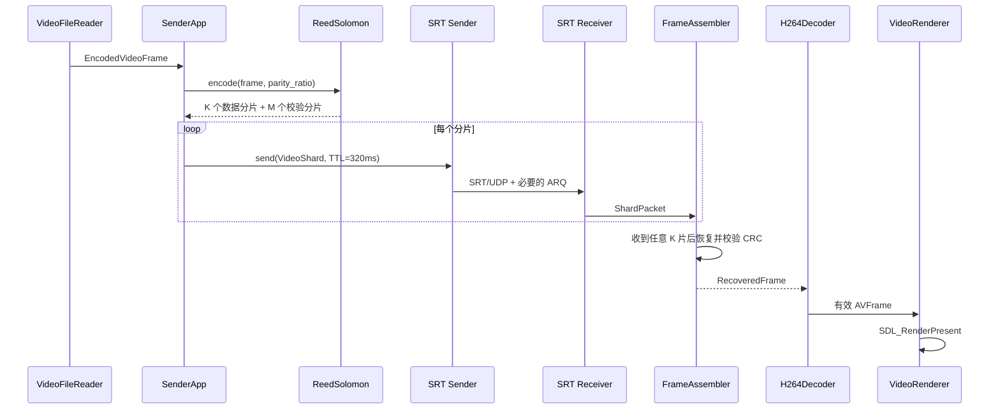
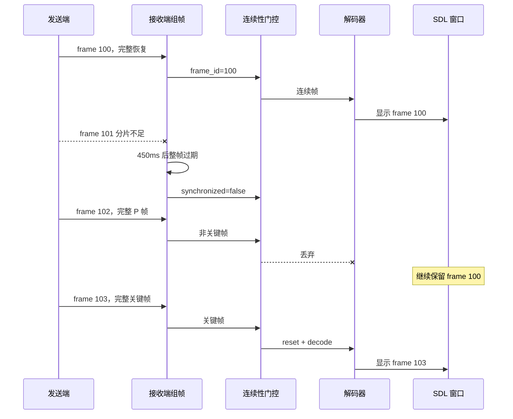
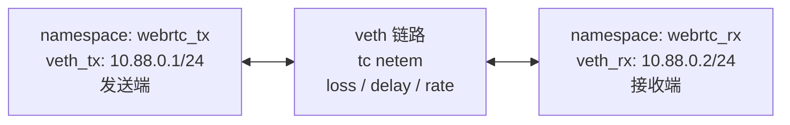

# SRT 弱网视频工程说明

本文面向第一次接触本工程的开发者，说明工程要解决的问题、整体架构、核心原理、代码组织、运行方式和调试方法。读完后，应能快速回答以下问题：

- 视频从文件到接收端画面经历了哪些处理？
- SRT、应用层 FEC、CRC 和关键帧门控分别解决什么问题？
- 为什么网络很差时画面可能冻结，却不应出现花屏？
- 码率、帧率、分辨率和 FEC 冗余如何自动调整？
- 每个源码文件负责什么，修改某项功能时应从哪里入手？
- 如何构建、运行、模拟弱网并验证输出流完整性？

---

## 1. 工程概述

### 1.1 工程目标

本工程是一个运行于 Linux 的原生 C++ 弱网视频传输程序。一个可执行文件 `srt_weak_video` 同时支持发送端和接收端两种角色：

- **发送端**读取本地视频文件，解码原视频，按当前弱网档位缩放并重新编码为低延迟 H.264，然后对每个完整 H.264 编码帧进行 Reed-Solomon FEC 分片，通过 SRT 发送。
- **接收端**接收分片，恢复完整帧，进行 CRC、帧序和关键帧检查，随后解码并通过 SDL 显示，同时可把通过检查的 H.264 帧保存为裸码流文件。

工程优先保证：

> 可以卡顿、延迟、降低码率或降低分辨率，但不能把不完整或引用链已经损坏的帧交给解码器显示。

因此，在无法恢复完整视频帧时，接收端会停止提交新画面，SDL 窗口继续保留最后一次成功显示的完整画面。恢复过程需要等到新的完整关键帧，随后才重新开始连续解码。

### 1.2 工程不是什么

需要避免几个常见误解：

- 它不是 WebRTC 工程，不包含 ICE、DTLS、SRTP、浏览器互通或 WebRTC 信令。
- 它不是简单的“文件复制工具”，发送端会根据网络状态实时改变编码参数。
- 它不是直接把 MP4 容器通过 SRT 发送，而是传输自定义协议封装的 H.264 帧分片。
- 它不保证极端丢包下画面始终连续，设计目标是完整帧优先。
- 它目前是单发送端、单接收端模型，不是多路转发服务器。
- 当前输入源是本地视频文件，尚未直接接入摄像头或实时采集设备。

### 1.3 核心技术

| 层次 | 使用技术 | 主要作用 |
| --- | --- | --- |
| 输入与编解码 | FFmpeg、libx264 | 读取任意常见视频文件，解码、缩放并编码为低延迟 H.264 |
| 传输 | SRT 1.5.5 Live Message API | 提供 UDP 上的可靠传输、ARQ、拥塞信息和消息边界 |
| 应用层抗丢包 | Intel ISA-L Reed-Solomon | 对每个完整编码帧增加可配置冗余分片 |
| 完整性保护 | CRC32 | 确认 FEC 恢复后的帧与发送前完全一致 |
| 防花屏控制 | 帧序连续性与关键帧门控 | 丢失参考帧后停止解码 P 帧，等待完整关键帧重新同步 |
| 显示 | SDL2、libswscale | 异步显示解码画面，并保留最后一帧 |
| 弱网仿真 | Linux network namespace、veth、tc netem | 构造隔离的发送/接收网络并注入丢包、延迟和限速 |

---

## 2. 总体架构

### 2.1 端到端数据链路

```mermaid
flowchart LR
    subgraph TX["发送端进程"]
        A["视频文件<br/>MP4/MKV/其他 FFmpeg 支持格式"]
        B["FFmpeg 输入解码"]
        C["抽帧与分辨率缩放"]
        D["libx264 低延迟编码"]
        E["单帧 CRC32"]
        F["Reed-Solomon FEC 分片"]
        G["SVT1 自定义消息封装"]
        H["SRT Live Message 发送"]

        A --> B --> C --> D --> E --> F --> G --> H
    end

    N["单条弱网链路<br/>丢包 / 延迟 / 带宽受限"]

    subgraph RX["接收端进程"]
        I["SRT Message 接收"]
        J["协议解析"]
        K["按 epoch + frame_id 组帧"]
        L["FEC 恢复"]
        M["CRC32 校验"]
        O["帧序与关键帧门控"]
        P["FFmpeg H.264 严格解码"]
        Q["SDL 异步显示"]
        R["保存 H.264 裸流"]

        I --> J --> K --> L --> M --> O --> P --> Q
        O --> R
    end

    H --> N --> I
    I -. "接收端丢包报告" .-> H
```



整个系统包含两条逻辑方向：

1. **媒体正向通道**：发送端向接收端发送 H.264 帧的 FEC 分片。
2. **网络反馈反向通道**：接收端根据 SRT 接收统计估算链路丢包率，向发送端发送 `NetworkReport`，用于选择编码和 FEC 档位。

二者都复用同一条双向 SRT 连接，不依赖备用物理链路。

### 2.2 组件关系



---

## 3. 发送端工作原理

发送端入口是 `SenderApp::run()`，主流程位于 `src/sender.cpp`。

### 3.1 建立连接与自动重连

发送端以 caller 方式连接接收端：

1. 调用 `SrtSocket::connect_to()` 创建并配置 SRT socket。
2. 连接成功后递增 `connection_epoch`。
3. 每次新连接都强制下一帧为关键帧。
4. 连接断开后等待 100 ms 再重连。
5. 连续失败时采用指数退避，最大等待时间为 1000 ms。

`connection_epoch` 会参与组成 `stream_epoch`：

```text
stream_epoch = (connection_epoch << 16) | encoder_epoch
```

其中：

- `connection_epoch` 区分不同 SRT 连接；
- `encoder_epoch` 区分不同编码器配置；
- 接收端用 `stream_epoch` 排除旧连接或旧编码配置中迟到的帧。

### 3.2 视频读取、抽帧和重编码

`VideoFileReader` 使用 FFmpeg 完成以下工作：


编码器的重要参数如下：

| 参数 | 当前值或策略 | 意义 |
| --- | --- | --- |
| 编码器 | `libx264` | 输出 H.264 |
| preset | `veryfast` | 降低 CPU 编码延迟 |
| tune | `zerolatency` | 避免面向离线质量的帧缓存 |
| profile | `baseline` | 简化解码依赖，提高兼容性 |
| B 帧 | 0 | 避免重排序延迟 |
| 参考帧 | 1 | 缩短引用链，降低丢帧影响 |
| GOP | 通常为 1 秒；极端档位为全 I 帧 | 周期性提供重新同步点 |
| repeat-headers | 1 | 关键帧重复携带 SPS/PPS，便于独立恢复 |
| scenecut | 0 | 避免场景切换打乱固定 GOP 设计 |

当自适应档位改变时，`VideoFileReader` 会重建编码器、递增 `encoder_epoch`，并强制输出关键帧。

输入文件播放结束后，发送端重新打开文件并从头循环播放。

### 3.3 单帧 FEC 编码

每个 H.264 编码帧独立作为一个 FEC block，不会和其他帧混合。这样做的好处是：

- 恢复成功或失败都以完整视频帧为单位；
- 某帧恢复失败不会产生“半帧”数据；
- 接收端可以直接在完整帧边界执行 CRC 和关键帧策略；
- 分片迟到时，可以按帧的超时时间整体丢弃。

FEC 编码步骤：

1. 以约 1000 字节为目标大小计算数据分片数 `K`。
2. 根据当前档位的 `parity_ratio` 计算校验分片数 `M`。
3. 使用 ISA-L Cauchy Reed-Solomon 矩阵生成 `M` 个校验分片。
4. 总共发送 `K + M` 个等长分片。

近似关系为：

```text
K = ceil(frame_bytes / 1000)
M = max(1, ceil(K * parity_ratio))
```

只要接收端在 `K + M` 个分片中收到任意 `K` 个有效分片，理论上就能恢复原始帧。可容忍的分片丢失数量最多为 `M`，但实际效果还会受到 SRT ARQ、消息 TTL、突发丢包和发送队列拥塞影响。

总分片数受 ISA-L/GF(2^8) 实现限制，不得超过 255。若单个编码帧过大导致无法放入一个 FEC block，该帧会被丢弃并请求后续关键帧。

### 3.4 分片发送

每个 FEC 分片被编码为一条独立 SRT message。媒体消息默认 TTL 为 320 ms，并允许乱序交付：

```text
msgttl = 320 ms
inorder = false
```

发送一个分片遇到 `WouldBlock` 时，会最多重试 20 次，每次间隔 2 ms。若仍无法发送：

- 当前帧剩余分片不再发送；
- 自适应控制器收到人为构造的 `100% loss / 500 ms RTT` 紧急网络状态；
- 立即降到最保守档位；
- 下一次编码强制关键帧；
- 发送循环暂停 100 ms。

这能防止应用持续向已经堵塞的发送队列灌入过期视频。

---

## 4. SRT 传输层

SRT 封装位于 `src/transport/srt_transport.*`。

### 4.1 连接模式

- 发送端：SRT caller，调用 `connect_to()`。
- 接收端：SRT listener，调用 `create_listener()` 和 `accept()`。
- 地址族：当前只解析 IPv4。
- 监听积压：1，当前设计只服务一个发送端。
- 传输类型：`SRTT_LIVE`。
- API 模式：Message API，保留每个应用消息的边界。

### 4.2 关键参数

| SRT 参数 | 当前值 | 作用 |
| --- | ---: | --- |
| `SRTO_LATENCY` | 350 ms | SRT 重传与时基交付预算 |
| `SRTO_TSBPDMODE` | 开启 | 使用时间戳交付机制 |
| `SRTO_TLPKTDROP` | 开启 | 丢弃来不及交付的包 |
| `SRTO_NAKREPORT` | 关闭 | 使用当前实现选择的 NAK 行为 |
| `SRTO_PAYLOADSIZE` | 1200 bytes | 控制 UDP 负载，降低 IP 分片风险 |
| `SRTO_SNDTIMEO` | 200 ms | 发送 API 超时 |
| `SRTO_RCVTIMEO` | 200 ms | 接收 API 超时 |
| `SRTO_PEERIDLETIMEO` | 15000 ms | 弱网静默期间避免过早断开 |
| `SRTO_SNDSYN` | false | 连接后使用非阻塞发送 |
| `SRTO_RCVSYN` | false | 连接后使用非阻塞接收 |
| `SRTO_FC` | 512 packets | 流控窗口 |
| `SRTO_SNDBUF` | 524288 bytes | 发送缓冲区 |
| `SRTO_MAXBW` | 375000 B/s | SRT 最大带宽约 3 Mbit/s |

SRT 提供 ARQ 重传和拥塞统计，应用层 FEC 则在视频帧粒度增加第二层恢复能力。两者的关系是互补而非替代：



### 4.3 本地 SRT 补丁

CMake 通过 `FetchContent` 下载并构建 SRT v1.5.5，随后执行 `cmake/patch_srt.cmake`。

该补丁调整 SRT 内部发送和关闭路径的锁行为，使公开的非阻塞 API 在极端双向丢包下尽量不要无限等待内部 mutex。应用层依赖 `WouldBlock` 返回值触发降档和重试，因此这个补丁属于当前弱网行为的一部分。

注意：

- 工程使用的是 `build/_deps` 中构建的 SRT，不会替换系统 SRT 包。
- 升级 SRT 版本时必须重新检查补丁中的源码字符串替换是否仍然匹配。

---

## 5. 自定义应用协议

协议实现位于 `src/protocol/messages.*`，当前协议版本为 2。

### 5.1 通用前缀

所有消息都以 6 字节前缀开始：

| 偏移 | 长度 | 字段 | 当前值 |
| ---: | ---: | --- | --- |
| 0 | 4 | magic | ASCII `SVT1` |
| 4 | 1 | version | `2` |
| 5 | 1 | message type | 见下表 |

所有多字节整数使用大端序编码。

### 5.2 消息类型

| 值 | 名称 | 当前用途 |
| ---: | --- | --- |
| 1 | `VideoShard` | 正在使用，承载视频帧的一个 FEC 分片 |
| 2 | `FrameAck` | 已定义编码/解析格式，当前业务流程未发送 |
| 3 | `KeyframeRequest` | 已定义编码/解析格式，当前业务流程未发送 |
| 4 | `NetworkReport` | 正在使用，接收端向发送端反馈丢包率 |

当前关键帧请求由发送端在连接、编码器切换和拥塞事件后本地触发，并不是接收端通过 `KeyframeRequest` 消息触发。

### 5.3 VideoShard 格式

按当前实际序列化字段计算，固定头长度为 58 字节，后面紧跟分片 payload：

| 字段 | 类型 | 说明 |
| --- | --- | --- |
| magic/version/type | 6 bytes | 协议标识 |
| flags | `uint16` | bit 0 表示关键帧 |
| stream_epoch | `uint32` | 连接 epoch 与编码器 epoch 的组合 |
| frame_id | `uint64` | 当前连接内递增的帧号 |
| encoded_at_unix_us | `uint64` | 编码完成时的 Unix 微秒时间戳 |
| source_to_encoded_us | `uint32` | 选中源帧到编码完成的处理耗时 |
| original_size | `uint32` | FEC 前完整 H.264 帧长度 |
| frame_crc | `uint32` | 完整帧 CRC32 |
| bitrate_kbps | `uint32` | 发送该帧时的目标码率 |
| width/height | 各 `uint16` | 编码分辨率 |
| data_shards | `uint16` | 数据分片数 `K` |
| parity_shards | `uint16` | 校验分片数 `M` |
| shard_index | `uint16` | 当前分片序号 |
| shard_size | `uint16` | 每个 FEC 分片长度 |
| payload_size | `uint16` | 当前消息 payload 长度 |
| payload | bytes | FEC 数据或校验分片 |

源码中的 `kShardHeaderSize = 63` 目前只用于提前预留 `vector` 容量，不参与线上长度校验；协议解析以字段读取结果和 `offset + payload_size == message_size` 为准。

### 5.4 NetworkReport 格式

控制消息总长度为 22 字节：

| 字段 | 类型 | 说明 |
| --- | --- | --- |
| magic/version/type | 6 bytes | `type = NetworkReport` |
| loss_basis_points | `uint32` | 丢包率基点，10000 表示 100% |
| sequence | `uint64` | 单连接内递增序号，用于排除旧报告 |
| reserved | `uint32` | 当前为 0 |

协议版本不向后兼容。接收端遇到错误 magic、错误版本、非法长度或非法字段时，会直接忽略消息。

---

## 6. 接收端工作原理

接收端入口是 `ReceiverApp::run()`，主流程位于 `src/receiver.cpp`。

### 6.1 生命周期

接收端启动后：

1. 打开输出 H.264 文件，默认以截断方式创建。
2. 初始化 SDL 显示线程；使用 `--no-display` 时保留解码流程但不创建窗口。
3. 创建 SRT listener 并循环等待连接。
4. 每次接收新连接时清空分片组装缓存和待显示队列。
5. 连接断开后继续监听，不销毁 `ReceiverApp`、SDL 显示线程或最后已显示画面。

这使得 SRT 重连期间窗口不会被销毁或清黑。

### 6.2 分片组装与 FEC 恢复

`FrameAssembler` 使用以下键缓存未完成帧：

```text
(stream_epoch, frame_id)
```

收到第一个分片时创建 `PartialFrame`，随后校验同帧所有分片的关键元数据是否一致。只有收到至少 `data_shards` 个分片后，才尝试 Reed-Solomon 解码。

恢复后的数据必须满足：

```text
CRC32(recovered_frame) == frame_crc
```

不满足时不会产生 `RecoveredFrame`。

未完成帧在首次收到分片 450 ms 后过期。过期后整个帧被丢弃，并增加 `dropped` 计数。已经完成帧的去重记录保留 2 秒，用于忽略迟到的重复分片。

### 6.3 防花屏状态机

完整 FEC 恢复和 CRC 正确还不够。H.264 P 帧可能引用先前帧；如果中间有一帧丢失，继续解码后续 P 帧仍可能导致错误传播或花屏。

接收端通过 `synchronized_`、`stream_epoch_` 和 `last_decoded_frame_id_` 维护解码同步状态：



具体规则：

- 旧 `stream_epoch` 的迟到帧直接丢弃。
- `stream_epoch` 改变时重置解码器并进入等待关键帧状态。
- 已处理过或倒序到达的 `frame_id` 直接丢弃。
- 同步状态下发现 `frame_id` 不连续，立即失去同步。
- 未同步状态下的所有非关键帧都丢弃。
- 只有完整、CRC 正确且成功解码的关键帧才能恢复同步。
- 解码器启用 `AV_EF_EXPLODE | AV_EF_CAREFUL`，标记损坏的输出帧不会提交显示。

这里的“冻结上一帧”不是主动复制旧帧，而是停止调用 `SDL_RenderPresent`。SDL 窗口中最近一次成功呈现的纹理继续保留。

### 6.4 输出文件

接收端只从第一个成功处理的关键帧开始写输出文件，避免生成一个从 P 帧开头、无法独立解码的裸流。

写入内容是通过完整性和同步检查后的 H.264 编码帧，不是 SDL 渲染后的像素。每帧写入后会立即 `flush()`，便于测试中实时检查文件，但这会带来一定磁盘 I/O 开销。

---

## 7. 网络质量反馈与自适应

### 7.1 为什么采用接收端丢包统计

发送端自身的短窗口 SRT 发送统计在重传、低码率和短采样窗口下可能不能准确反映接收侧实际链路损失。因此接收端读取累计 SRT 接收统计，并在积累足够样本后计算丢包率。

接收端使用：

- `pktRecvUniqueTotal`：唯一接收包数；
- `pktRcvDropTotal`：已经确定为过期丢弃的原始包数；
- `pktRcvLossTotal`：SRT 认为缺失的原始包数。

定义：

```text
resolved_packets = received_unique + dropped_original
loss_percent = missing_original / resolved_packets * 100%
```

`NetworkLossEstimator` 每累计至少 400 个已决包才产生一次新丢包样本，减少低码率下小样本比例剧烈波动。

若累计包数 3 秒没有增长，则认为接收停滞：

- 向发送端报告 100% 丢包；
- 数据恢复流动后重置估算基线；
- 避免把停滞区间永久带入后续丢包率。

### 7.2 反馈使用规则

发送端优先使用 12 秒内收到的接收端丢包报告，并使用本地 SRT 统计中的 RTT 和带宽。超过 12 秒没有新报告后，丢包率退回发送端 SRT 统计。

网络报告带递增 `sequence`，发送端会忽略重复或旧序号报告。

### 7.3 自适应档位

当前共有 9 个档位。网络越差，码率、帧率和分辨率越低，FEC 冗余越高：

| Level | 触发丢包率 | 码率 | FPS | 分辨率 | FEC 比例 | 编码模式 |
| ---: | --- | ---: | ---: | --- | ---: | --- |
| 0 | `<= 3%` | 2000 kbps | 30 | 1280x720 | 0.15 | 常规 GOP |
| 1 | `> 3%` | 1400 kbps | 20 | 1280x720 | 0.25 | 常规 GOP |
| 2 | `> 7%` | 900 kbps | 10 | 960x540 | 0.50 | 常规 GOP |
| 3 | `> 15%` | 500 kbps | 5 | 640x360 | 0.75 | 常规 GOP |
| 4 | `> 30%` | 250 kbps | 3 | 426x240 | 1.00 | 常规 GOP |
| 5 | `> 50%` | 120 kbps | 2 | 426x240 | 2.00 | 全 I 帧 |
| 6 | `> 70%` | 50 kbps | 1 | 320x180 | 3.00 | 全 I 帧 |
| 7 | `> 80%` | 20 kbps | 1 | 160x90 | 5.00 | 全 I 帧 |
| 8 | `> 90%` | 8 kbps | 1 | 128x72 | 11.00 | 全 I 帧 |

说明：

- FEC 比例 `1.00` 表示校验分片数约等于数据分片数。
- FEC 比例 `11.00` 表示每 1 份数据约配置 11 份校验分片，但总分片仍受 255 上限限制。
- 极端档位使用全 I 帧，牺牲压缩效率换取每帧独立可解码。
- `--max-video-kbps` 不直接生成任意码率，而是选择不超过上限的最高已有档位。

RTT 也会设置最低降档级别：

| RTT 条件 | 最低 Level |
| --- | ---: |
| `> 150 ms` | 3 |
| `> 220 ms` | 5 |
| `> 300 ms` | 6 |
| `> 400 ms` | 7 |

### 7.4 降档和升档策略



策略特点：

- **降档快**：网络恶化时一次跳到满足当前条件的档位。
- **升档慢**：正常情况下要求连续 5 个窗口满足 `loss < 3%` 且 `RTT < 130 ms`，然后只提升一级。
- **紧急恢复**：临时 `WouldBlock` 或停滞可能把系统推到 Level 8。此时允许每 5 个稳定窗口恢复一级，直到达到当前网络实际要求的档位，避免长期困在最低质量。
- **档位变化必出关键帧**：编码参数变化后不能继续依赖旧参考链。

---

## 8. 延迟指标

运行时配置文件为 `runtime-config.yaml`。程序默认从可执行文件所在目录加载，因此 CMake 会把根目录配置复制到 `build/runtime-config.yaml`。

默认配置：

```yaml
latency:
  metric: encode_to_decode
  window_seconds: 10
```

一次只能选择一种媒体延迟指标：

| 指标 | 起点 | 终点 | 说明 |
| --- | --- | --- | --- |
| `encode_to_assemble` | 发送端 H.264 编码完成 | 接收端 FEC 恢复完整帧 | 主要观察传输、重传、排队和组帧耗时 |
| `encode_to_decode` | 发送端 H.264 编码完成 | 接收端产出有效解码帧 | 默认指标，包含组帧与解码 |
| `source_to_display` | 发送端选中源解码帧 | 接收端调用 `SDL_RenderPresent` | 覆盖缩放、编码、传输、解码和软件呈现 |

接收端每秒输出当前滑动窗口内：

- `latency_avg`：平均值；
- `latency_p95`：95 分位；
- `latency_invalid`：无效样本累计数。

`window_seconds` 可设置为 1 到 3600 秒。

### 8.1 时钟要求

这些指标使用发送端和接收端的 Unix 时间做单向测量，因此两台主机必须通过 NTP 或 PTP 同步系统时钟。以下样本会被判为无效：

- 结束时间早于开始时间；
- 延迟大于 60 秒；
- 起始时间戳为 0；
- 来自上一次连接 generation 的迟到渲染任务。

`source_to_display` 的终点是 `SDL_RenderPresent` 调用完成，不包含显示器扫描输出和液晶面板响应时间。使用 `--no-display` 时该指标显示 `n/a`。

---

## 9. 显示线程设计

`VideoRenderer` 独立运行一个 SDL 线程，解码线程通过 `submit()` 提交 `AVFrame` 克隆。

设计要点：

- 队列最多保留 3 帧；
- 队列已满时丢弃最旧待显示帧，优先降低显示延迟；
- 分辨率或像素格式变化时重建 SDL texture 和 swscale 上下文；
- 输入统一转换为 YUV420P 后更新 SDL texture；
- SRT 断开时只清空尚未显示的队列，不销毁窗口；
- 没有新完整帧时不会主动清空画面。

`rendered_frames` 实际统计的是成功解码后提交给 renderer 的帧数；即使 `--no-display`，该计数仍会增加。它更接近“有效解码帧数”，不严格等于显示器实际呈现次数。

---

## 10. 代码目录与职责

```text
srt-weak-network-video/
├── CMakeLists.txt
├── README.md
├── PROJECT_GUIDE.md
├── runtime-config.yaml
├── development-parameters.yaml
├── cmake/
│   └── patch_srt.cmake
├── scripts/
│   └── netem_loss.sh
├── src/
│   ├── main.cpp
│   ├── sender.hpp/.cpp
│   ├── receiver.hpp/.cpp
│   ├── common/
│   │   ├── types.hpp
│   │   ├── utils.hpp/.cpp
│   │   ├── adaptation.hpp/.cpp
│   │   ├── network_quality.hpp/.cpp
│   │   ├── runtime_config.hpp/.cpp
│   │   └── latency_stats.hpp/.cpp
│   ├── transport/
│   │   └── srt_transport.hpp/.cpp
│   ├── protocol/
│   │   ├── messages.hpp/.cpp
│   │   └── frame_assembler.hpp/.cpp
│   ├── fec/
│   │   └── reed_solomon.hpp/.cpp
│   └── video/
│       ├── video_file_reader.hpp/.cpp
│       ├── h264_decoder.hpp/.cpp
│       └── video_renderer.hpp/.cpp
└── tests/
    ├── protocol_tests.cpp
    ├── adaptation_tests.cpp
    ├── network_quality_tests.cpp
    ├── runtime_config_tests.cpp
    └── latency_stats_tests.cpp
```

### 10.1 顶层文件

| 文件 | 职责 |
| --- | --- |
| `CMakeLists.txt` | 拉取并编译 SRT，查找 FFmpeg/SDL2/ISA-L，构建主程序和测试 |
| `README.md` | 面向使用者的快速构建、运行和弱网测试说明 |
| `PROJECT_GUIDE.md` | 面向新开发者的完整原理和代码导览 |
| `runtime-config.yaml` | 程序实际读取的延迟指标配置 |
| `development-parameters.yaml` | 开发阶段参数、调优历史和验证场景记录；程序不会读取 |

不要把 `development-parameters.yaml` 当作运行时配置。当前大部分 SRT、自适应、FEC 和超时参数仍编译在 C++ 源码中。

### 10.2 主流程

| 文件 | 关键类/函数 | 职责 |
| --- | --- | --- |
| `src/main.cpp` | `main()` | 命令行解析、信号处理、配置加载、启动发送端或接收端 |
| `src/sender.*` | `SenderApp` | 连接与重连、编码帧循环、FEC 分片发送、网络反馈、自适应 |
| `src/receiver.*` | `ReceiverApp` | 监听与重连、收包、组帧、同步门控、解码、输出和统计 |

### 10.3 common

| 文件 | 职责 |
| --- | --- |
| `types.hpp` | 角色、端点、视频档位、编码帧、网络快照等共享数据结构 |
| `utils.*` | 停止信号、单调时钟、Unix 时钟、`host:port` 解析 |
| `adaptation.*` | 9 级视频/FEC 档位和升降档状态机 |
| `network_quality.*` | 基于累计 SRT 接收计数的批量丢包率估算 |
| `runtime_config.*` | 解析受限格式的延迟 YAML 配置 |
| `latency_stats.*` | 线程安全的滑动窗口平均值、P95 和无效样本统计 |

### 10.4 transport、protocol 和 fec

| 文件 | 职责 |
| --- | --- |
| `srt_transport.*` | SRT 生命周期、socket 参数、IPv4 地址解析、收发和统计转换 |
| `messages.*` | `SVT1` 协议消息序列化与反序列化 |
| `frame_assembler.*` | 按帧缓存分片、FEC 恢复、CRC 校验、超时和去重 |
| `reed_solomon.*` | ISA-L Reed-Solomon 编解码与 CRC32 |

### 10.5 video

| 文件 | 职责 |
| --- | --- |
| `video_file_reader.*` | 输入文件解复用、解码、按 FPS 抽帧、缩放、libx264 编码 |
| `h264_decoder.*` | 严格模式 H.264 解码，过滤损坏输出帧 |
| `video_renderer.*` | SDL 显示线程、3 帧队列、像素格式转换和显示延迟终点 |

### 10.6 tests

| 测试 | 覆盖内容 |
| --- | --- |
| `protocol_tests` | FEC 丢片恢复、协议 v2 编解码、CRC、FrameAssembler |
| `adaptation_tests` | 丢包/RTT 阈值、快速降档、慢速恢复、码率上限 |
| `network_quality_tests` | 最小样本量、累计计数、计数器复位、停滞后重置 |
| `runtime_config_tests` | 默认值、合法配置、非法指标/窗口/字段 |
| `latency_stats_tests` | 平均值、P95、无效样本、generation 和窗口过期 |

---

## 11. 关键运行时序

### 11.1 正常发送与显示



### 11.2 丢帧后的恢复



---

## 12. 构建与运行

### 12.1 依赖

Ubuntu 22.04 示例：

```bash
sudo apt install cmake g++ git pkg-config nasm libisal-dev \
  libavcodec-dev libavformat-dev libavutil-dev libswscale-dev libsdl2-dev
```

还需要 FFmpeg 环境中包含 `libx264` 编码器。可检查：

```bash
ffmpeg -hide_banner -encoders | grep libx264
```

首次 CMake 配置会从 GitHub 获取 SRT v1.5.5，因此需要网络访问。

### 12.2 构建

```bash
cmake -S . -B build
cmake --build build -j2
ctest --test-dir build --output-on-failure
```

主要产物：

```text
build/srt_weak_video
build/runtime-config.yaml
build/protocol_tests
build/adaptation_tests
build/network_quality_tests
build/runtime_config_tests
build/latency_stats_tests
```

### 12.3 本机运行

先启动接收端：

```bash
./build/srt_weak_video \
  --role receiver \
  --listen 0.0.0.0:9000 \
  --output-file /tmp/srt-received.h264
```

再启动发送端：

```bash
./build/srt_weak_video \
  --role sender \
  --connect 127.0.0.1:9000 \
  --video-file /path/to/input.mp4 \
  --max-video-kbps 2000
```

无图形环境中：

```bash
./build/srt_weak_video \
  --role receiver \
  --listen 0.0.0.0:9000 \
  --output-file /tmp/srt-received.h264 \
  --no-display
```

指定配置文件：

```bash
./build/srt_weak_video \
  --role receiver \
  --listen 0.0.0.0:9000 \
  --config /path/to/runtime-config.yaml
```

### 12.4 命令行参数

| 参数 | 角色 | 说明 |
| --- | --- | --- |
| `--role sender|receiver` | 两者 | 必选，指定角色 |
| `--connect host:port` | sender | 接收端地址 |
| `--listen host:port` | receiver | 本地监听地址 |
| `--video-file path` | sender | 必选，输入视频 |
| `--max-video-kbps 8..2000` | sender | 发送端允许使用的最高档位码率 |
| `--output-file path` | receiver | 恢复后 H.264 裸流路径，默认 `received.h264` |
| `--no-display` | receiver | 不创建 SDL 窗口 |
| `--config path` | 两者 | 指定运行配置；当前只有接收端使用延迟配置 |

当前 `host:port` 解析不支持 IPv6 的 `[address]:port` 写法。

---

## 13. 弱网测试

### 13.1 测试拓扑

`scripts/netem_loss.sh` 可创建两个 network namespace：



namespace 名称沿用了原 WebRTC 测试脚本，但本工程传输协议是 SRT。

### 13.2 完整测试步骤

创建拓扑：

```bash
sudo ./scripts/netem_loss.sh ns-up
```

在接收 namespace 中启动接收端：

```bash
sudo ip netns exec webrtc_rx ./build/srt_weak_video \
  --role receiver \
  --listen 10.88.0.2:9000 \
  --output-file /tmp/srt-received.h264 \
  --no-display
```

在另一个终端启动发送端：

```bash
sudo ip netns exec webrtc_tx ./build/srt_weak_video \
  --role sender \
  --connect 10.88.0.2:9000 \
  --video-file /home/u20/code/jetson-2k.mp4 \
  --max-video-kbps 2000
```

确认连接和媒体已经流动后，再注入双向 30% 丢包和 50 ms 延迟：

```bash
sudo ./scripts/netem_loss.sh ns-loss 30 50 both
sudo ./scripts/netem_loss.sh ns-show
```

同时设置丢包、延迟和双向独立带宽：

```bash
sudo ./scripts/netem_loss.sh ns-link \
  30 50 500kbit 200kbit
```

其中：

- `tx_rate` 限制从 `webrtc_tx` 发出的流量；
- `rx_rate` 限制从 `webrtc_rx` 发出的反馈和 SRT 控制流量。

清除干扰并删除 namespace：

```bash
sudo ./scripts/netem_loss.sh ns-clear both
sudo ./scripts/netem_loss.sh ns-down
```

注意：在主机 namespace 中启动的进程不会穿过上述 veth 链路。即使接收端监听 `0.0.0.0`，也只监听它所在 namespace 的网络接口。

### 13.3 验证无损坏帧

对接收端保存的裸流做严格解码检查：

```bash
ffmpeg -v error -err_detect explode \
  -i /tmp/srt-received.h264 -f null -
```

预期：

- 命令没有输出解码错误；
- 接收端 `decoder_errors=0`；
- 丢包严重时 `dropped` 可以增加；
- `sync` 可能暂时变为 0；
- 恢复完整关键帧后 `sync` 回到 1；
- 画面允许冻结，但不应显示不完整帧。

---

## 14. 日志解读

### 14.1 发送端

连接日志：

```text
srt_connecting=10.88.0.2:9000
srt_connected=1 connection_epoch=1
srt_connected=0
```

每秒统计示例：

```text
loss=30.1% rtt=112ms bandwidth=2600kbps retransmit=842 \
profile=250kbps/3fps/426x240 fec=1
```

字段：

| 字段 | 含义 |
| --- | --- |
| `loss` | 优先采用接收端反馈的链路丢包率 |
| `rtt` | SRT 统计的往返时延 |
| `bandwidth` | SRT 估计带宽，不等同于当前视频码率 |
| `retransmit` | SRT 重传包计数 |
| `profile` | 当前目标码率、FPS、分辨率 |
| `fec` | 当前校验分片与数据分片比例 |

拥塞日志：

```text
srt_send_congested=1 profile=8kbps/1fps/128x72
```

表示应用连续重试后仍无法写入 SRT 发送队列，已进入紧急档位。

### 14.2 接收端

每秒统计示例：

```text
bandwidth=2600kbps rtt=112ms \
latency_type=encode_to_decode latency_avg=420.1ms latency_p95=498.3ms \
latency_invalid=0 frames=123 dropped=8 decoder_errors=0 sync=1 rendered=123
```

字段：

| 字段 | 含义 |
| --- | --- |
| `bandwidth` | SRT 接收侧估计带宽 |
| `rtt` | SRT RTT |
| `latency_type` | 当前选中的媒体延迟指标 |
| `latency_avg/p95` | 当前滑动窗口统计 |
| `latency_invalid` | 时钟或时间戳异常样本数 |
| `frames` | 成功解码的完整帧总数 |
| `dropped` | 组帧超时、旧帧、重复帧、帧序缺口后的 P 帧等丢弃总数 |
| `decoder_errors` | 完整帧进入解码器后仍解码失败的次数 |
| `sync` | 是否处于可连续解码状态 |
| `rendered` | 提交给 renderer 的有效解码帧数 |

---

## 15. 常见修改入口

| 想修改的功能 | 主要文件 | 注意事项 |
| --- | --- | --- |
| 调整 SRT 延迟、TTL、缓冲区 | `src/transport/srt_transport.cpp` | 同时考虑 320 ms 消息 TTL、350 ms SRT latency 和 450 ms 组帧超时 |
| 调整码率/分辨率/FEC 档位 | `src/common/adaptation.cpp` | 更新测试和 `development-parameters.yaml` |
| 改变升降档策略 | `src/common/adaptation.cpp` | 保持快速降档、慢速升档的稳定性 |
| 改变丢包率算法 | `src/common/network_quality.*`、`src/receiver.cpp` | 区分累计 SRT 计数和短窗口统计 |
| 增加协议字段 | `src/protocol/messages.*` | 必须升级协议版本并更新 header size 和测试 |
| 改变 FEC 分片大小或上限 | `src/fec/reed_solomon.*` | 保证 SRT message 接收缓冲区足够大 |
| 接入摄像头 | `src/video/video_file_reader.*` | 可抽象输入源接口，保持 `EncodedVideoFrame` 输出契约 |
| 更换编码器 | `src/video/video_file_reader.cpp` | 必须保留低延迟、关键帧和参数集可恢复策略 |
| 修改防花屏逻辑 | `src/receiver.cpp` | 不要在参考链断裂后直接放行 P 帧 |
| 修改显示队列 | `src/video/video_renderer.*` | 队列越大越平滑，但显示延迟越高 |
| 增加运行时配置 | `src/common/runtime_config.*` | 当前解析器只支持严格、有限的 YAML 子集 |
| 修改 SRT 版本 | `CMakeLists.txt`、`cmake/patch_srt.cmake` | 重新验证本地补丁 |

---

## 16. 设计取舍与当前限制

### 16.1 完整性优先于连续性

本工程主动接受以下退化：

- 降码率；
- 降帧率；
- 降分辨率；
- 增加 FEC 带宽；
- 丢弃无法按时恢复的完整帧；
- 等待关键帧期间冻结画面。

换取的目标是：不把不完整帧或已经失去参考链的 P 帧送入显示路径。

### 16.2 延迟预算是多层共同决定的

当前相关时限包括：

- SRT latency：350 ms；
- 媒体 message TTL：320 ms；
- 发送超时：200 ms；
- 组帧过期：450 ms；
- SDL 队列：最多 3 帧。

这些参数不能孤立理解。增加 SRT latency 可能提高重传成功率，但也会增加冻结前的等待和端到端延迟；缩短组帧超时会更快放弃坏帧，但可能错过稍晚到达、原本可由 FEC 恢复的分片。

### 16.3 FEC 有带宽代价

高档位 FEC 并不是免费恢复：

```text
发送字节约为 原始编码帧字节 * (1 + parity_ratio)
```

例如比例 2.0 近似意味着每 1 份数据再发送 2 份校验，总流量约为编码数据的 3 倍。极端档位能够使用很高冗余，是因为基础视频码率已经降到很低。

### 16.4 当前功能限制

- 仅支持 IPv4。
- 单 listener 同时只接收一个连接。
- 输入仅为文件并循环播放。
- 输出仅为 H.264 裸流和本地 SDL 窗口。
- 没有加密口令或身份认证配置。
- 没有音频。
- 没有远程控制平面。
- `FrameAck` 和 `KeyframeRequest` 协议类型目前未接入实际流程。
- 多数参数仍为编译时常量。
- 接收端输出文件在进程启动时截断，跨重连继续写入同一文件。
- `source_to_display` 依赖跨主机时钟同步。
- SDL 窗口标题当前仍为历史名称 `WebRTC Receiver`，不影响实际 SRT 功能。

---

## 17. 新开发者推荐阅读顺序

建议按以下顺序阅读代码：

1. `README.md`：先实际构建并跑通本机收发。
2. `src/main.cpp`：了解参数和两个角色的入口。
3. `src/common/types.hpp`：熟悉核心数据结构。
4. `src/sender.cpp`：理解发送循环、反馈和 FEC 分片。
5. `src/video/video_file_reader.cpp`：理解视频为何会随档位重新编码。
6. `src/protocol/messages.*`：理解线上消息格式。
7. `src/protocol/frame_assembler.cpp` 和 `src/fec/reed_solomon.cpp`：理解完整帧恢复。
8. `src/receiver.cpp`：重点理解关键帧同步和防花屏门控。
9. `src/transport/srt_transport.cpp`：理解 SRT 参数和网络统计。
10. `src/common/adaptation.cpp`：理解弱网质量策略。
11. `src/video/h264_decoder.cpp` 和 `src/video/video_renderer.cpp`：理解解码显示与冻结上一帧。
12. `tests/`：通过断言确认协议和状态边界。

---

## 18. 一句话总结

本工程的核心不是单独依赖 SRT、FEC 或低码率，而是把它们组合成一条完整的弱网视频保护链：

```text
网络反馈驱动降档
    + SRT 限时重传
    + 单帧 Reed-Solomon 冗余
    + CRC 完整性校验
    + 帧序连续性检查
    + 关键帧重新同步
    + 显示端保留最后完整画面
```

当网络无法持续承载视频时，系统优先降低质量并减少更新频率；当一帧无法确认完整时，系统宁可不更新画面，也不会把有风险的数据继续交给解码显示链路。
